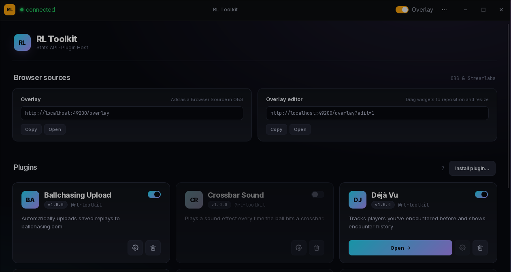

# RL Toolkit

A plugin-based overlay platform for Rocket League. Install the launcher, enable the plugins you want, and they render as transparent overlays on top of the game, or as Browser Sources in OBS.

> **Status: alpha.** Shipping and self-updating, but APIs and storage formats may still change between versions.



---

## What it is

You install one app: the **RL Toolkit launcher**. It bundles everything: the backend that talks to Rocket League's Stats API, the dashboard UI you see above, and the overlay window that floats on top of the game. From the dashboard you toggle plugins on and off, open per-plugin dashboards in their own tabs, configure them, and grab Browser Source URLs for OBS or Streamlabs.

It does not inject into the game, hook input, or read game memory. It only consumes RL's own Stats API over TCP, so EAC has no problem with it.

## Bundled plugins

| Plugin | What it does |
|---|---|
| **Déjà Vu** | Tracks players you've encountered before and shows encounter history. |
| **Session Tracker** | Wins, losses, and stats for the current launcher session. |
| **Demolitions** | Demolitions dealt this match and all-time. |
| **Ballchasing Upload** | Auto-uploads saved replays to ballchasing.com. |
| **Crossbar Sound** | Plays a sound effect when the ball hits a crossbar. |

Plus any third-party plugins you install. The launcher's **Install plugin…** button accepts `.rltp` packages: pick one and it's live.

## Install

Grab the latest release from the [releases page](https://github.com/s1gh/RLToolkit/releases/latest):

| Platform | Artefact | Notes |
|---|---|---|
| Windows | `RLToolkit_<v>_x64-setup.exe` | NSIS installer, auto-updates. |
| Windows | `RLToolkit_<v>_x64-portable.zip` | No-admin or USB-stick. No auto-update. |
| Linux   | `RLToolkit_<v>_x86_64.AppImage` | glibc 2.39+ (Ubuntu 24.04+, Fedora 40+, current Arch). Auto-updates. |
| Linux   | `RLToolkit_<v>_x86_64-portable.tar.gz` | Tarball. No auto-update. |

In Rocket League, set *Settings → Video → Display Mode* to **Borderless**. Exclusive fullscreen blocks all compositor-level overlays (Tauri, Discord, Steam Overlay, OBS Browser Source). It's a fullscreen-rendering limitation that affects every overlay tool, not specific to RL Toolkit.

### Linux runtime requirements

The AppImage is built on Ubuntu 24.04, so the glibc floor is **2.39**. It runs on Ubuntu 24.04+, Fedora 40+, and current Arch / Cachy / Manjaro. On older distros (Ubuntu 22.04, Debian 12, RHEL 9) use the portable tarball instead.

The AppImage expects these on the host:

- libwayland-client / cursor / egl / server, and libepoxy. These are present on every modern Linux desktop because GTK 3 lists them as hard dependencies regardless of session type.
- WebKit2GTK 4.1 (`libwebkit2gtk-4.1.so.0`).
- Mesa: `libEGL.so.1`, `libGL.so.1`, `libgbm.so.1`.

WebKit2GTK 4.1 is the one to watch. It's an extra package on Debian and Ubuntu.

```bash
# Arch / Cachy / Manjaro
sudo pacman -S webkit2gtk-4.1

# Debian / Ubuntu
sudo apt install libwebkit2gtk-4.1-0

# Fedora
sudo dnf install webkit2gtk4.1
```

## OBS / Streamlabs

The launcher exposes two URLs for browser-source capture:

- **Overlay:** `http://localhost:49200/overlay`. All enabled plugins, transparent background, ready to drop into OBS as a Browser Source.
- **Overlay editor:** `http://localhost:49200/overlay?edit=1`. Same view, but you can drag widgets to reposition and resize them. Layout persists.

The launcher's *Browser sources* panel has copy buttons for both. Default port is `49200`. Change it with `rl-toolkit -port <n>` if you need to.

## Writing a plugin

A plugin is **a folder with a `manifest.json` and one or more HTML files**. No build step, no backend code, no compilation. If you can write a webpage, you can write a plugin.

### From zero to running plugin in under a minute

```bash
rl-toolkit new my-plugin            # scaffolds plugins/my-plugin/
rl-toolkit dev plugins/my-plugin    # hot-reloads into the running overlay on save
```

Edit the HTML, hit save, see the change live. No restart, no reload.

### Minimal overlay

```html
<!doctype html>
<html>
<head>
  <script src="/sdk.js" data-plugin="my-plugin" data-view="overlay"></script>
</head>
<body>
  <div id="last-goal">queue up and wait for a goal</div>
  <script>
    const el = document.getElementById('last-goal');
    RLT.plugin.register({
      events: {
        _GoalScored(goal) {
          const scorer = goal.scorer?.name ?? 'unknown';
          el.textContent = `${scorer}: ${goal.goalSpeed ?? 'n/a'} km/h`;
        },
      },
    });
  </script>
</body>
</html>
```

That's a working plugin. The `RLT` global gives you match state, lifecycle events, per-plugin storage, a settings panel, and a stats registry. See [`docs/PLUGINS.md`](docs/PLUGINS.md) for the full SDK reference.

### A plugin can have up to four views

| View | Where it renders | Required? |
|---|---|---|
| **Overlay** | Transparent click-through window on top of the game (and the OBS Browser Source). | Yes |
| **Dashboard** | Full browser tab opened from the launcher's "Open" button. Use it for tables, charts, history. | Optional |
| **Settings** | Modal inside the launcher with per-plugin configuration UI. | Optional |
| **Background** | Hidden iframe in the launcher for always-on work that runs without a visible UI. | Optional |

### Sharing plugins

```bash
rl-toolkit pack plugins/my-plugin   # → my-plugin-1.0.0.rltp
```

Send the `.rltp` to anyone running RL Toolkit. They click *Install plugin…* in the launcher and pick the file.

## Build from source

See [`docs/BUILD.md`](docs/BUILD.md) for the full build, packaging, and release flow on Linux and Windows. The short version:

```bash
# Linux (Arch / Cachy / Manjaro)
sudo pacman -S base-devel rustup go webkit2gtk-4.1 gtk-layer-shell pkg-config nodejs npm
rustup default stable
npm install

go build -o rl-toolkit ./backend/cmd/rl-toolkit   # backend (~5 sec)
cd overlay/src-tauri && cargo build --release     # widget (~1 min first time)
```

## Repository layout

```
backend/        Go backend: HTTP server, SSE bus, plugin host, CLI
overlay/        Rust + Tauri 2 launcher and overlay window
plugins/        Bundled plugins (Déjà Vu, Session Tracker, etc.)
docs/           BUILD.md, PLUGINS.md
release/        Build outputs (gitignored)
```

## License

[MIT](LICENSE).
